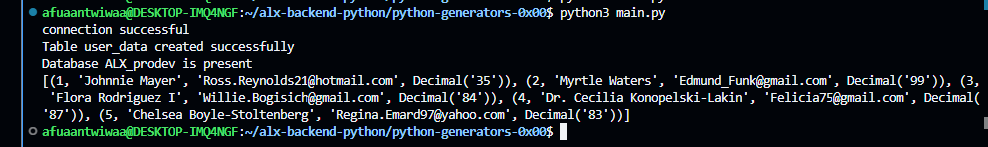
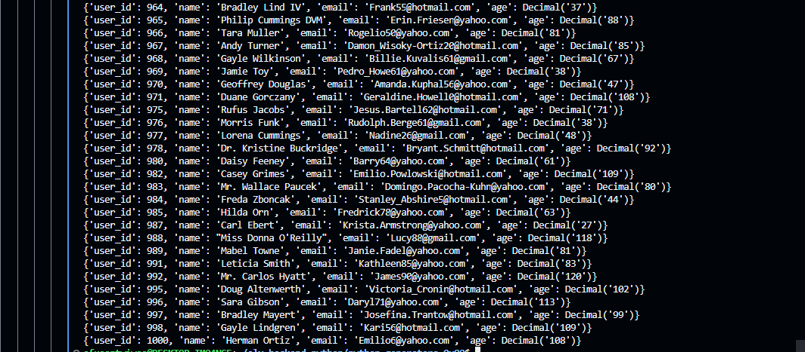
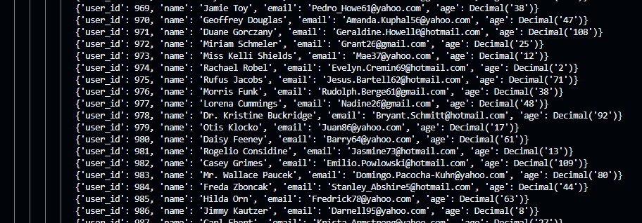
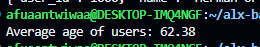

# ALX ProDev Database Seeder

This project sets up and seeds a MySQL database (`ALX_prodev`) with sample user data from a CSV file using Python. It includes secure credential handling with environment variables and supports streaming of data using generators.

## Features

* Connects to a MySQL server
* Creates a database (`ALX_prodev`) if it doesn't exist
* Creates a `user_data` table with `AUTO_INCREMENT` `user_id`
* Loads sample data from `user_data.csv`
* Prevents duplicate entries based on email
* Uses environment variables to protect MySQL credentials

---

## Setup Instructions

### 1. Clone the Repository

```bash
git clone https://github.com/yourusername/your-repo-name.git
cd your-repo-name
```

### 2. Install Dependencies

```bash
pip install mysql-connector-python python-dotenv
```

### 3. Create a `.env` File

Create a `.env` file in the root directory of your project with the following content:

```env
MYSQL_ROOT_PASSWORD=your_mysql_root_password
```

**Note**: Do **not** commit this file to version control. It's added to `.gitignore` by default.

### 4. Prepare Your Data

Ensure a `user_data.csv` file is present in the root directory with the following headers:

```csv
name,email,age
John Doe,john@example.com,30
Jane Smith,jane@example.com,25
```

> `user_id`. It is auto-generated.

### 5. Run the Seeder Script

```bash
python3 main.py
```

This will:

* Create the database
* Create the table (dropping it first if it exists)
* Load and insert records from `user_data.csv`

---

## Project Structure

```txt
├── main.py              # Entry point that runs the full setup
├── seed.py              # Module with connection, creation, and insert logic
├── user_data.csv        # CSV file with sample user data
├── .env                 # Environment variables (not committed)
├── .gitignore           # Ignores .env and other non-essential files
```

## Security

* Uses `python-dotenv` to safely load MySQL credentials from a `.env` file
* Ensures `.env` is excluded from Git using `.gitignore`

---

## License
This project is part of the ALX Software Engineering Program. Use as a learning tool.


## RESULTS
**db connection**



**batch processing**



**lazy paginate**



**avg**


